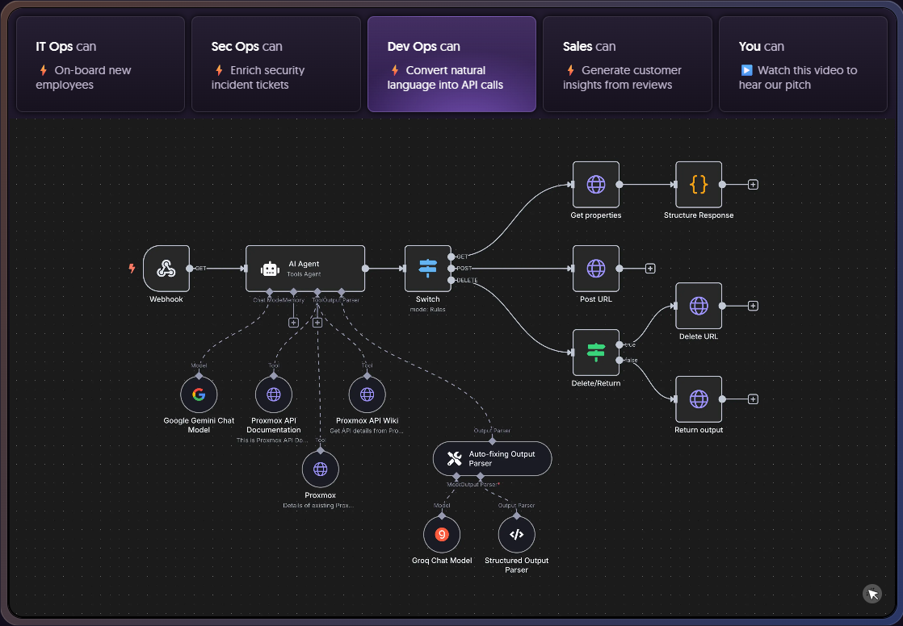

# Get Started with n8n



## Key words

- Automation : Use tools to automate repetitive tasks
- n8n : *"Flexible AI workflow automation for technical teams"*


## n8n Fundamentals

- n8n is open-source no code workflow automation tool
- n8n lets you connect apps and services to automate workflows and integrate AI driven tasks
- n8n is a work flow

    ```mermaid
    graph LR
        A[Input<br/>Trigger/Webhook] --> B[Action/Processing<br/>Transform Data]
        B --> C[Output<br/>Action/Result]
        
        style A fill:#9b87f5,stroke:#7c3aed,stroke-width:2px,color:#fff
        style B fill:#6366f1,stroke:#4f46e5,stroke-width:2px,color:#fff
        style C fill:#8b5cf6,stroke:#7c3aed,stroke-width:2px,color:#fff
    ```

## Reference

- [n8n](https://n8n.io/)
- [Complete n8n Masterclass: Build Al Agents & Automate Workflows (Zero to Hero)](https://youtu.be/DkV7ztrhLh8?si=vbswg7qXdmCy1fn6)
